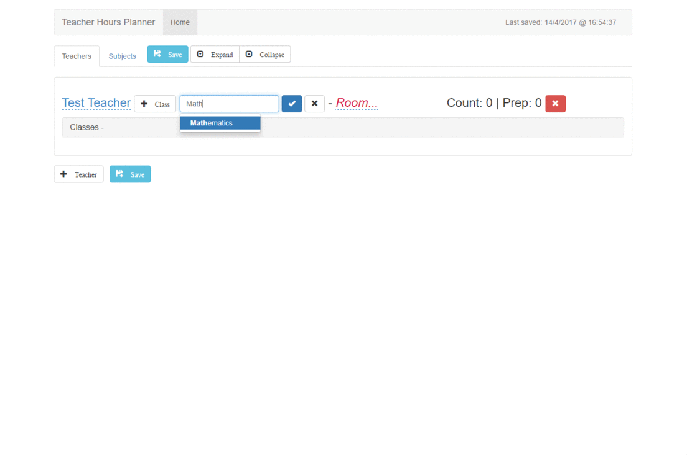

# Teacher Hours Manager

Simple NodeJS app to manage the teacher list of a school - input the teachers, their main subject and assigned room and how many hours they have with each class. After that you can rearrange & balance the number of hours between teachers with the same subject.

This doesn't do timetable or scheduling, only manages the list of teachers, subjects, classroom and hours per class allocation with flat-file storage.

### Installation & Requirments
Make sure you have NodeJS and NPM installed on your system or a portable version copied to the application (cloned repo) folder. Install dependencies (Express for web server, Express basic auth for user accounts and SocketIO for saving the data in the background with no POST-ing or reloading) with `npm install` and run with `node .`
Set authorized users, port, and file to edit (located in _config/_ folder) in *index.js*.

### Usage
Just browse to **http://localhost:3003**, log in and manage the data in the two data tabs (Teachers and Subjects). The app will save the data to the file on the server periodically or when you click the save button. You will be logged out when you close your browsing session. Use the existing "Find in page" _CTRL and F_ to search for text if you need.
### To-Do
- Better saving mechanism.
- Include web frontend libraries with Bower (Bootstrap, Angular + xEditable, jQuery and the fonts are bundled for now).
### License, disclaimer and known limitations
This is a completely open source project, built on open source modules and libraries and licensed under [Apache License 2.0](https://www.apache.org/licenses/LICENSE-2.0.html).